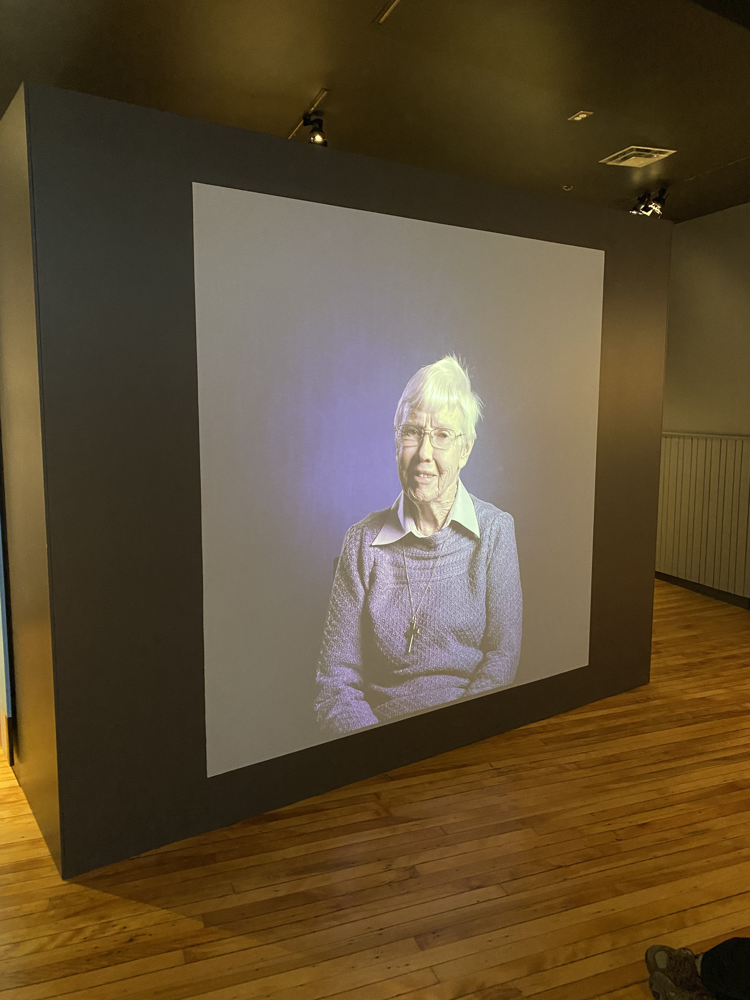
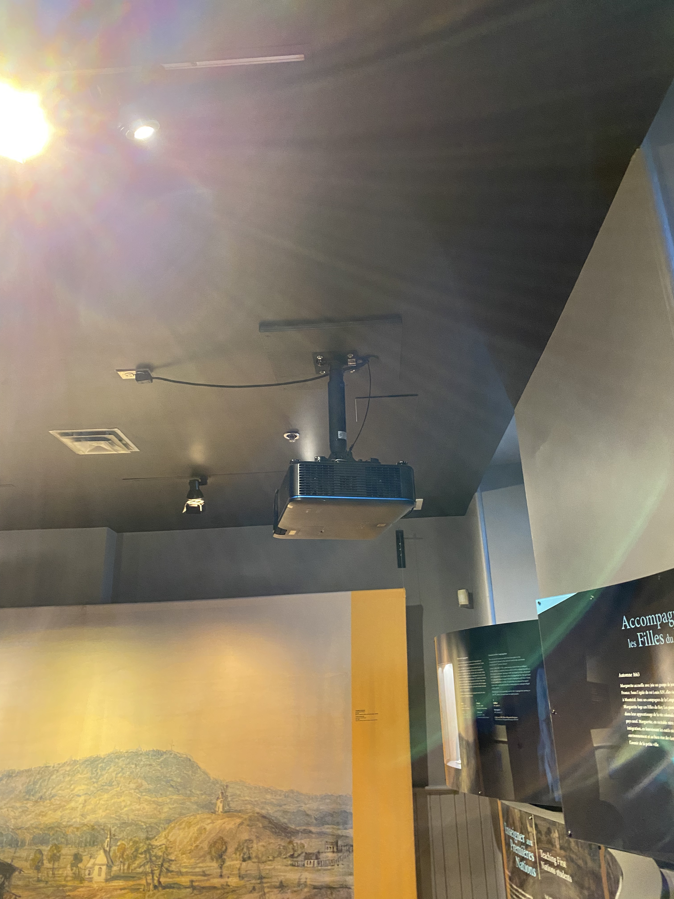
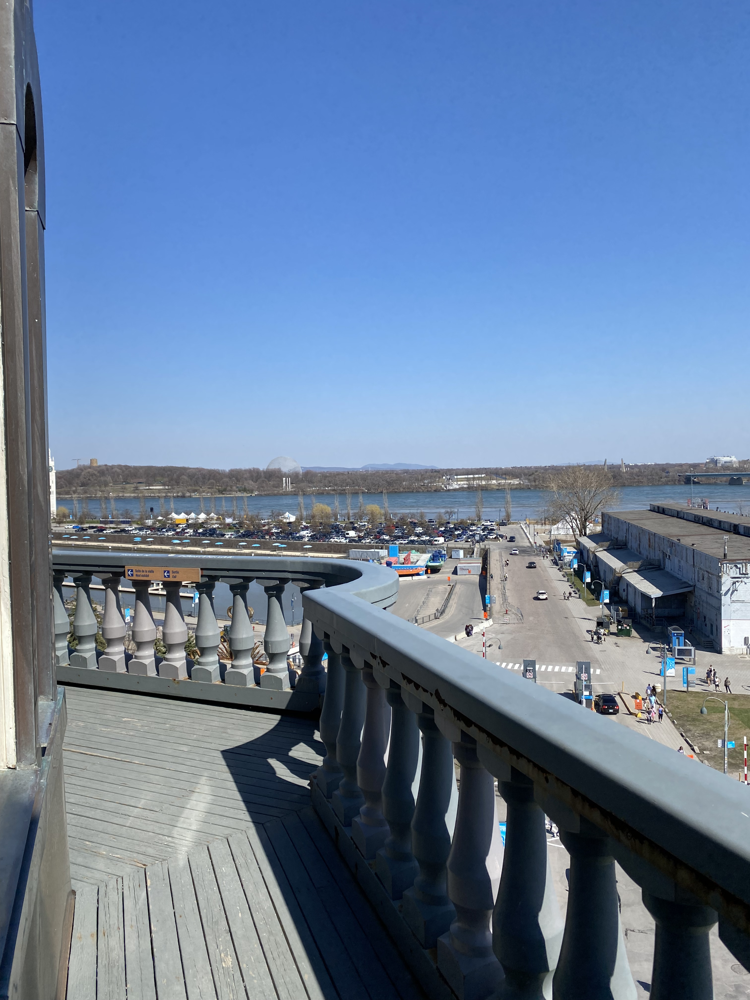

# Musée Marguerite-Bourgeoys la Chapelle Notre-Dame-de-Bon-Secours #
 
## Nom de l'exposition: Osez Meet Marguerite Chapelle Notre-Dame-de-Bon-Secours ##

Type d'exposition
Permanente et intérieure

Date de la visite
Vendredi le 15 Avril 2023

Lieu de l'exposition
400, rue Saint-Paul Est, Vieux-Montréal

Nom de l'artiste
N/A

Année de réalisation
N/A

Type d'installation
Oeuvre audiovisuelle contemplative

### Description de l'oeuvre ###
Cette œuvre audiovisuelle captivante donne la parole aux femmes chrétiennes d'époques révolues. Leurs récits empreints de force et de foi révèlent leur rôle essentiel dans la diffusion de la doctrine chrétienne, malgré les défis et les contraintes sociales, offrant ainsi une perspective inspirante sur l'histoire méconnue de ces femmes.

PHOTO

### Mise en espace ###
_____________________________________________________________________________________________________________________________________________________________
Cette oeuvre est projetté sur un mur dans une pièce avec plusieurs oeuvres évoquant différentes périodes du christianisme., je dirais quelle prend 2 mètres de large et de hauteur. Il y a un banc en bois juste devant pour contempler loeuvre. L'oeuvre est projetté par un projecteur qui est situé tout juste devant. La salle est relativement petite. À gauche de la salle, une sortie discrète dévoile un escalier invitant les visiteurs à explorer davantage. Les fils passent par le plafond donc il n'y a aucun fil visible.

### Composantes ###
_____________________________________________________________________________________________________________________________________________________________
Au cœur de la salle, un unique projecteur illumine l'écran de ses rayons. Le son vient du dispositif de projection lui-même. Les videos et les voix créent une expérience immersive, faisant revivre les témoignages d'un passé lointain et permettant aux spectateurs de se plonger pleinement dans cette précieuse archive historique.

### Nécessités ###
_____________________________________________________________________________________________________________________________________________________________
- Projecteur de qualité : Utilisez un projecteur de haute résolution capable de projeter des images nettes. 

- Système audio : Un système audio de qualité pour diffuser les témoignages. 

- Mur de projection : Mur de projection de taille appropriée dans un endroit visible.

- Connectivité : Avoir les câbles et les connexions nécessaires pour relier le projecteur à une source vidéo et audio.

- Éclairage ambiant : Adaptez l'éclairage ambiant pour créer une atmosphère propice à la projection.

- Installation discrète : Intégrez les équipements de projection de manière discrète en évitant de perturber l'architecture et l'ambiance du lieu.

- Conservation du patrimoine : Prendre en compte les précautions nécessaires pour protéger le batiment lors de l'installation des équipements, en évitant tout dommage ou altération des éléments architecturaux.

### Expérience vécue ###
_____________________________________________________________________________________________________________________________________________________________
L'expérience s'est malheureusement révélée fade et sans éléments véritablement attrayants pour retenir mon attention. Les femmes, tout en partageant leurs témoignages, semblaient constamment critiquer notre génération, basant leurs jugements uniquement sur leurs propres sentiments. Cette approche subjective a créé un sentiment de déconnexion et d'incompréhension, rendant l'expérience décevante et peu enrichissante. Aucun élément visuel n'a pu retenir mon intérêt, rendant l'expérience rapidement oubliable.

### Ce qui m'a plu ###
_____________________________________________________________________________________________________________________________________________________________
J'ai été enchanté par plusieurs autres œuvres qui ont su captiver mon attention et éveiller mon intérêt. De plus, l'endroit lui-même était tout simplement époustouflant. L'atmosphère du Vieux-Montréal est tout simplement magnifique avec son charme historique. J'ai eu l'occasion aussi de monter les 120 marches qui menent au plus haut point du Vieux-Montréal.  

### Améliorations 
_____________________________________________________________________________________________________________________________________________________________

Pour rendre cette oeuvre encore plus captivante, envisager de recueillir des témoignages auprès de personnes qui ont une plus grande aisance sociale et qui s'expriment. Le choix de participants charismatiques et communicatifs pourrait donner une nouvelle énergie et une dynamique engageante aux témoignages. Cette approche permettrait de créer une connexion plus directe avec le public, rendant l'expérience à la fois immersive et inspirante.

