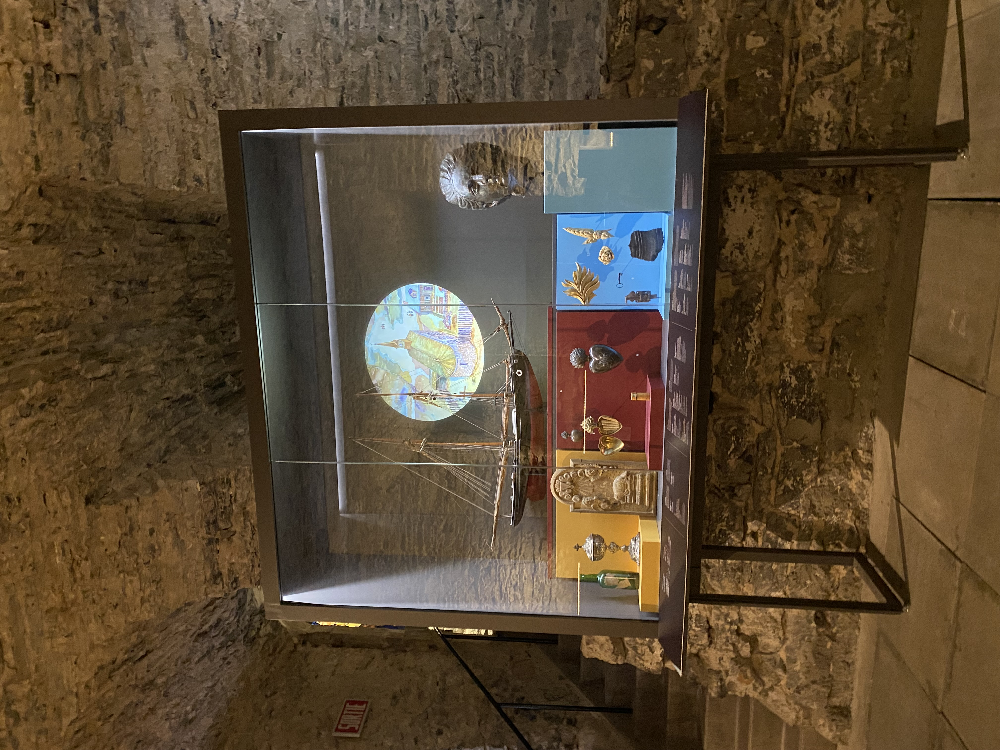

# Musée Marguerite-Bourgeoys la Chapelle Notre-Dame-de-Bon-Secours #
 
## Nom de l'exposition: Osez Meet Marguerite Chapelle Notre-Dame-de-Bon-Secours ##

Type d'exposition
Permanente et intérieure

Date de la visite
Vendredi le 15 Avril 2023

Lieu de l'exposition
400, rue Saint-Paul Est, Vieux-Montréal

Nom de l'artiste
N/A

Année de réalisation
N/A

Type d'installation
Oeuvre audiovisuelle contemplative

### Description de l'oeuvre ###
Cette œuvre audiovisuelle captivante donne la parole aux femmes chrétiennes d'époques révolues. Leurs récits empreints de force et de foi révèlent leur rôle essentiel dans la diffusion de la doctrine chrétienne, malgré les défis et les contraintes sociales, offrant ainsi une perspective inspirante sur l'histoire méconnue de ces femmes.

PHOTO

### Mise en espace ###
Cette oeuvre est placé sur une toile dans une pièce avec plusieurs autres oeuvre, je dirais quelle prend 2 mètres de large et de hauteur. Il y a un banc en bois juste devant pour comtempler loeuvre. L'oeuvre est projete par un projecteur qui est situé tout juste devant. La salle est relativement petite.  
