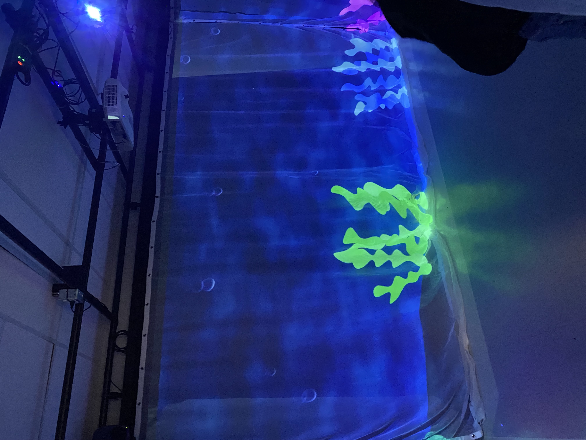
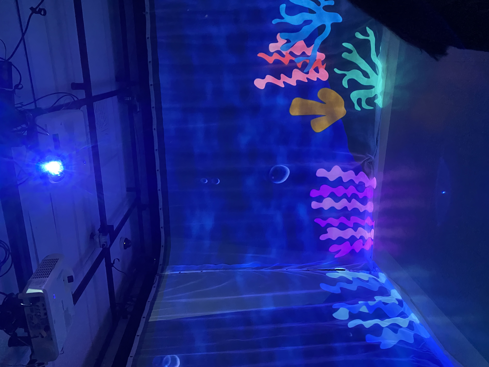

Projet par Florence Lapierre, Tracy Gua, Natacha Abdallah et Maria Laura Coronel

### Résumé: ###
_________________________________________________________________________________________________________________________________________________
Une projection interactive plonge les visiteurs au fond de l'océan pour en apprendre davantage sur les animaux en danger. Dans une petite pièce, 
entourée de projections de l'océan, les visiteurs peuvent regarder des animations d'animaux marins en utilisant une tablette.

### Thème: ###
_________________________________________________________________________________________________________________________________________________
En résumé, le mycélium symbolise la connexion par ses racines souterraines. Le projet Echomarine met l'accent sur l'importance des fonds marins et la beauté de leurs habitants. 
En sensibilisant les visiteurs, l'attraction vise à favoriser une relation avec la nature et les inciter à agir pour sa préservation. Cette approche est directement liée au thème central du projet.

### Installation en cours: ###
_________________________________________________________________________________________________________________________________________________
L'equipe était relativement tres bien avancé, il leur manquait une table et quelques animations mais sinon c'est tout!

### Incontournables ###
_________________________________________________________________________________________________________________________________________________

- Conception multimedia 
- Traitement audiovisuel 
- Animation 2d

### Technologies nouvelles
_________________________________________________________________________________________________________________________________________________
- Arduino

### Expérience: ###
_________________________________________________________________________________________________________________________________________________
Le visiteur entre dans le studio et les vagues se déclenchent avec les projections marines sur les trois rideaux. 
La musique joue et la projection devait devenir plus saturée, mais je ne l'ai pas remarqué.
Sur le podium, une tablette permet de choisir un animal marin et d'afficher une animation correspondante.
La description de l'animal apparaît également. Une fois l'animation terminée, le visiteur peut choisir un autre animal ou sortir de l'expérience. 
Les vagues s'arrêtent et la projection revient à son état initial.

C'etait une experience qui enveloppait l'espace dans une ambiance océanique. Les projections marines sur les trois rideaux créaient une atmosphère saisissante, me transportant dans les profondeurs mystérieuses de l'océan. C'etait un beau le spectacle visuel.Je dirais que j'ai grandement apprecie l'experience. 
