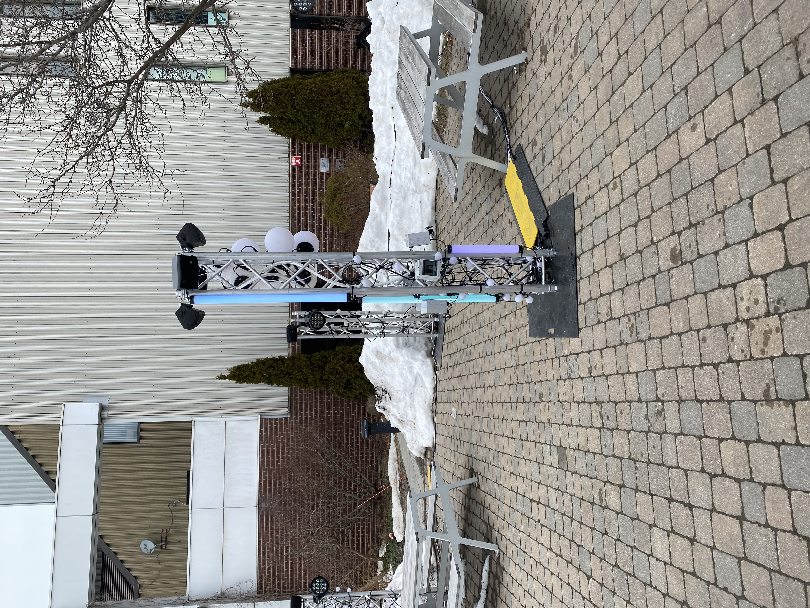
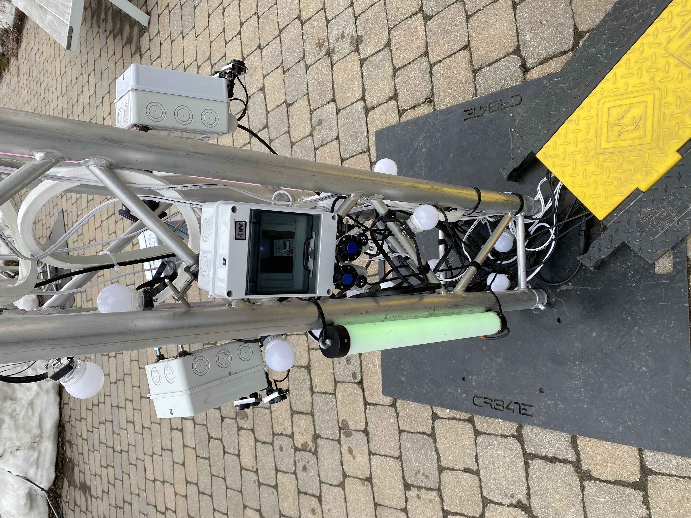
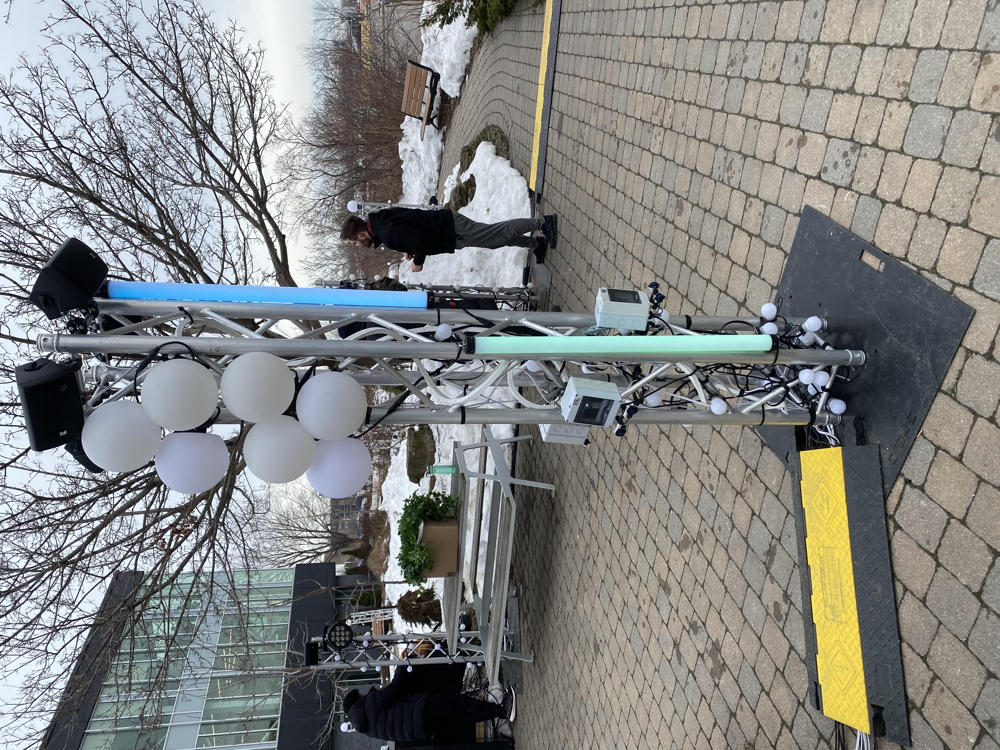
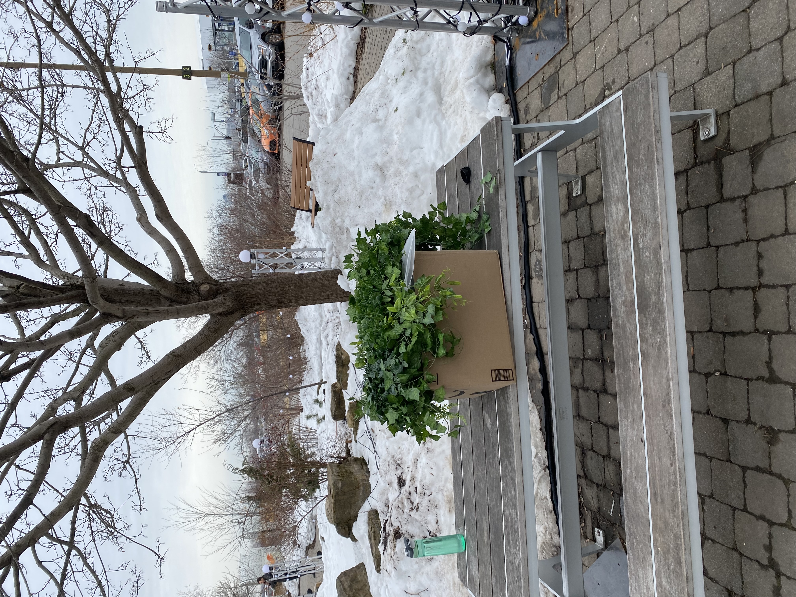
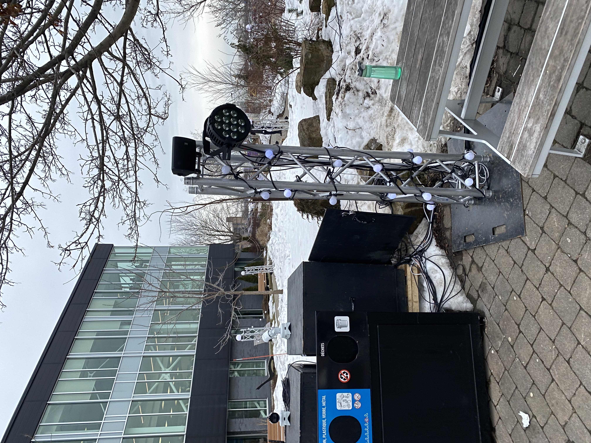
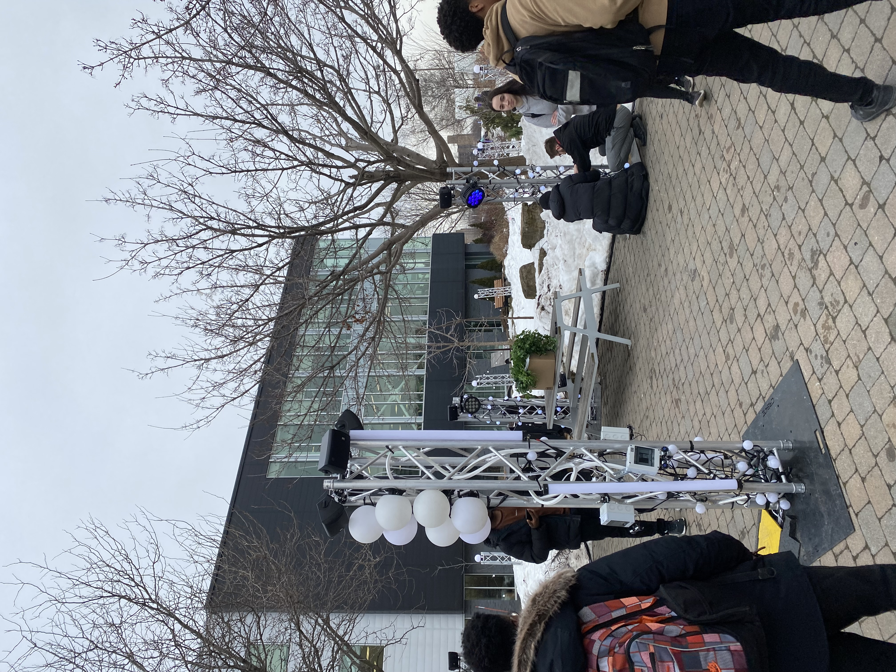

Projet par Meryem Berbiche, Loic Delorme,  Gabriel Leblanc, Dominic Roberts, Elwin Durand et Jean-Christophe.

### Résumé du projet:
______________________________________________________________________________________________________________________________________________________________________
Edria offre aux visiteurs une expérience immersive enchantrice avec des lumières et des sons qui sont activés par notre présence. Selon leur position, ils peuvent découvrir de nouvelles scènes et même créer de la musique en interagissant avec les autres visiteurs. L'objectif de ce projet est de créer une expérience réconfortante et visuellement captivante pour les visiteurs pendant les froides journées d'hiver, tout en nous rappelant la beauté de la nature et l'importance des interactions humaines.

### Lien:
______________________________________________________________________________________________________________________________________________________________________
Le projet s'inspire de la nature, comme le démontre l'ambiance créée par les plantes. Le thème du mycélium, qui est le nom d'un champignon, est présent à la fois dans l'aspect enchanteur de l'environnement. Les capteurs de mouvement déclenchent des motifs de lumières et de la musiques ce qui demande laparticipation de plus que une personne. Sinon vous pouvez utilisez vos deux mains pour activer deux cotés en meme temps.

### Les Incontournables
______________________________________________________________________________________________________________________________________________________________________
- Interactivite ludique
- Modelisation 3d
- Objets interactif

### Nouvelles technologies
______________________________________________________________________________________________________________________________________________________________________
- Logiciel de mapping 

### Installation:
_______________________________________________________________________________________________________________________________________________________________________
Il y aura huit colonnes au total, afin de couvrir une plus grande surface et maintenir l'ambiance souhaitée. Les capteurs de mouvement sont de haute qualité. Des plantes synthétiques seront ajoutées aux colonnes pour partiellement cacher la technologie, les fils etc. Le projet était déjà en phase finale. 

### Expérience:
_______________________________________________________________________________________________________________________________________________________________________
Lorsque l'utilisateur s'approche, l'un des détecteurs s'active, déclenchant un motif de lumière et de musique spécifique. Si plusieurs visiteurs activent les quatre capteurs en même temps, une animation spéciale d'une minute se déclenche sur toutes les colonnes pour leur plus grand plaisir. Après cela, les visiteurs peuvent partir ou essayer différentes combinaisons pour prolonger leur expérience.
