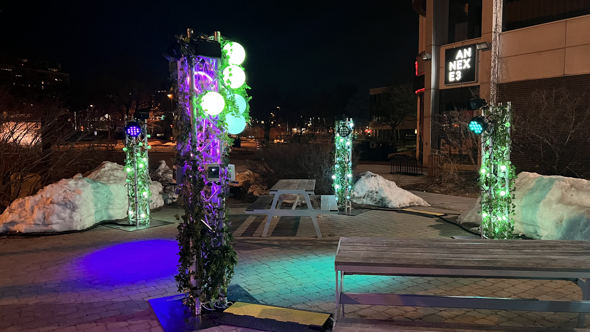

Le projet choisi à partir des projets des finissants

### Nom de l'exposition
____________________________________________________
Mycélium

### Type d'exposition
____________________________________________________
Temporaire et Extérieure

### Date de la visite
____________________________________________________
N/A 
Je n'ai pas visité l'oeuvre les soirées, je travaillais. 

### Lieu de l'exposition
____________________________________________________
Le collège Montmorency 

### Titre de l'oeuvre
____________________________________________________
Edria

### Finissants 
___________________________________________________________________________________________________
Meryem Berbiche, Loic Delorme, Gabriel Leblanc, Dominic Roberts, Elwin Durand et Jean-Christophe.

### Années de réalisation
____________________________________________________
2022-2023

### Type d'installation
____________________________________________________
Intéractive

### Description de l'oeuvre
_______________________________________________________________________________________________________________________________________________________________________
Expérience immersive enchantrice avec des lumières et des sons qui sont activés par notre présence. Selon leur position, ils peuvent découvrir de nouvelles scènes et même créer de la musique en interagissant avec les autres visiteurs. L'objectif de ce projet est de créer une expérience réconfortante et visuellement captivante pour les visiteurs pendant les froides journées d'hiver, tout en nous rappelant la beauté de la nature et l'importance des interactions humaines.

JE N'AI PAS ASSISTÉE A L'OEUVRE DURANT LES SOIRÉES D'EXPOSITIONS, CES PHOTOS ON ÉTÉ PRISES DIRECTEMENT SUR TIM MOMO:
https://tim-montmorency.com/2023/projets/EDRIA/docs/web/index.html

### Mise en espace
____________________________________________________
La structure de occupe fièrement le centre de l'endroit commun, juste devant la porte d'entrée. Sa taille et sa présence imposante lui confèrent une place de choix dans cet espace partagé. Avec une empreinte d'un mètre carré, sa demande une surface conséquente pour s'exprimer pleinement. C'est une expérience visuelle saisissante dès l'entrée. La structure est enrobée de feuilles et lumières. La position stratégique de cet emplacement central en fait un point focal naturel, invitant les visiteurs à découvrir son esthétique unique et à s'engager dans une réflexion sur l'art et l'espace environnant. Le parcours prend vie avec Edria.

### Composantes et techniques
____________________________________________________

#### Lumières

(~8x25' 1x 50') DMX DOT STRING (festoon) (cr34te)
( 64x ) DMX DOT CLEAR (cr34te)
( 20x-25x ) Boule Lumineuse 200mm cr34te)
( x1 ) Boule Lumineuse 36' cr34te)
( 4x ) Tubes Opal 0.5M (cr34te)
( 2x ) Tubes Opal 1M (cr34te)
( x8 ) COLORado 2 Solo (cr34te)

Connection / controlleur
( ~2 ) CL-PBDF (cr34te)

#### Installation

Pond d'éclairage
( x8 ) 1' x 1' x 8' (triangle)
( x1 ) 2' x 2' x 8' (carré)
____________________________________________________

FL Studio (Version 21.0.0.3324)
VCV Rack (Version 2.2.1)
Madmapper (Version 2022.29850)
Arduino IDE (Version 2.0.3)

Éléments nécessaires pour la mise en exposition
____________________________________________________
- Poto en metal
- Capteurs
- Plantes
- Cameras
- Speakers

Expérience vécue
_______________________________________________________________________________________________________________________________________________________________________
L'objectif de ce projet était clairement atteint, car j'ai ressenti une réelle sensation de réconfort tout en étant visuellement captivé(e). Les lumières sont chatoyantes et les mélodies. En contemplant cette expérience immersive, j'ai été profondément. J'ai vraiment aimé cet oeuvre. J'ai réalisé l'importance des interactions humaines avec la technologie. 

Ce qui m'a plu
_______________________________________________________________________________________________________________________________________________________________________
L'aspect technique et la compléxité du travail. Les lumières, les sons etc. 

Aspects à changer selon moi
_______________________________________________________________________________________________________________________________________________________________________
Je ne changerai rien, car chaque élément de cette expérience artistique m'a apporté une satisfaction profonde.

- Github: https://github.com/F-C-A/EDRIA
- PRÉ-PROD: https://tim-montmorency.com/2023/projets/EDRIA/docs/web/preproduction.html
- TIM-MOMO: https://tim-montmorency.com/2023/projets/EDRIA/docs/web/index.html
